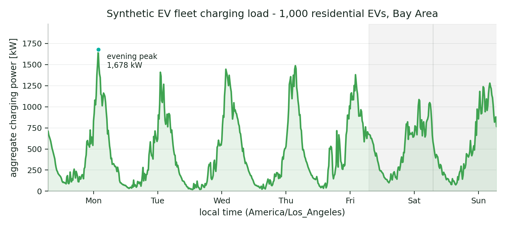

# ev-flow



*A reproducible, NHTS-grounded synthetic load curve for a 1,000-EV Bay Area residential fleet — from `pip install` to plot in under ten minutes.*

[](https://pypi.org/project/ev-flow/)
[](https://pypi.org/project/ev-flow/)
[](https://github.com/bertravacca/ev-flow/blob/main/LICENSE)
[](https://doi.org/10.5281/zenodo.20619156)

**ev-flow** generates synthetic plug-in electric vehicle (PEV) charging
behaviour for residential and workplace fleets, grounded in the National
Household Travel Survey (NHTS 2017) travel micro-data and a regional vehicle
sales-mix model. It runs a 9-stage pipeline (NHTS loading, vehicle-archetype
sampling, donor matching, travel-week building, plug-in modelling, state-of-
charge trajectory, and 15-minute / hourly rasterisation) and surfaces the
result through a small, lazy `Fleet` / `Profile` library API across eight US
regions — so you can pull plug-in status, charging sessions, SoC trajectories
and aggregate load curves without touching the underlying pipeline.

## Install

```bash
pip install ev-flow
```

!!! note "`ev-flow` on PyPI, `pev_synth` in Python"
    The PyPI distribution name is **`ev-flow`**, but the Python import name is
    **`pev_synth`**. This mirrors the well-known `scikit-learn` / `sklearn`
    convention: you `pip install ev-flow` and then `import pev_synth`. The two
    names refer to the same project throughout these docs.

The wheel ships **only** the Python package — it does not bundle the cached
fleet data, which is built from NHTS 2017 microdata on first run. See the
[Quickstart](quickstart.md) for the one-time bootstrap step before
`generate_profiles(...)` will return data.

## A first look

```python
import pev_synth as ps

ps.list_regions()
# ['bay_area', 'boston', 'chicago', 'dallas_fort_worth',
#  'la_basin', 'new_york_metro', 'seattle', 'us_national']

ps.list_profile_types()
# ['residential', 'workplace']

# After the one-time bootstrap (see Quickstart):
fleet = ps.generate_profiles('residential', n=1000, region='bay_area', seed=42)
prof = fleet[0]

# Boolean plug-in status at 15-minute resolution over a one-week window:
plugged = prof.plug_status('2001-01-01', '2001-01-08', freq='15min')

# Charging sessions intersecting a window:
sessions = prof.charging_sessions('2001-06-01', '2001-06-08')

# Fleet-aggregate charging power (kW) — a load curve:
load_kw = fleet.aggregate_load('2001-06-01', '2001-06-08', freq='1h')
```

The synthetic cache lives on a 2001 calendar; timestamps in any other year are
re-mapped to 2001 (month / day / hour-of-day preserved). The full window and
timezone semantics are documented on the [API Reference](api.md).

## Where to go next

- **[Quickstart](quickstart.md)** — install, bootstrap the data cache, and
  reach a load curve in under ten minutes.
- **[API Reference](api.md)** — the full `Fleet`, `Profile`,
  `generate_profiles` and region surface, generated from the source docstrings.
- **[Migration](migration.md)** — the `ev-flow` (PyPI) vs `pev_synth` (import)
  split, how internal callers that `import pev_synth` keep working, and the
  versioning policy.
- **[Issues](https://github.com/bertravacca/ev-flow/issues)** — report a bug or
  a validator discrepancy.
- **[Discussions](https://github.com/bertravacca/ev-flow/discussions)** — ask a
  question or share how you are using ev-flow.

## A note on honesty

ev-flow is built to be truthful about its limitations. The workplace pipeline
is fit from a small (105-vehicle) public EVWatts cohort whose plug-in median
(~12:00 local time) sits about three hours later than the literature-canonical
workplace median (~09:00); the package emits a `RuntimeWarning` to that effect
whenever you construct a `workplace` fleet. Vehicle-to-grid (V2G),
smart-charging optimisation, fleet-depot and public-charging behaviours are
**not** modelled. See the [Quickstart](quickstart.md#workplace-caveat) for the
workplace caveat in full.

## License & citation

ev-flow is released under the **MIT License**. The MIT license covers the
ev-flow *code*; the upstream data sources it is grounded in retain their own
licenses and attribution requirements (NHTS 2017, US Census ACS PUMS, EPA
fueleconomy.gov, the Mendeley SPEECh model under CC BY 4.0, and others) — see
[`ATTRIBUTION.md`](https://github.com/bertravacca/ev-flow/blob/main/ATTRIBUTION.md).

If you use ev-flow in your research, please cite it via the version-independent
Zenodo concept DOI:

> Travacca, Bertrand. *ev-flow: synthetic plug-in electric vehicle charging
> data.* Zenodo. <https://doi.org/10.5281/zenodo.20619156>

```bibtex
@software{travacca_ev_flow,
  author    = {Travacca, Bertrand},
  title     = {{ev-flow: synthetic plug-in electric vehicle charging data}},
  publisher = {Zenodo},
  doi       = {10.5281/zenodo.20619156},
  url       = {https://doi.org/10.5281/zenodo.20619156}
}
```

A machine-readable [`CITATION.cff`](https://github.com/bertravacca/ev-flow/blob/main/CITATION.cff)
is also provided in the repository.
